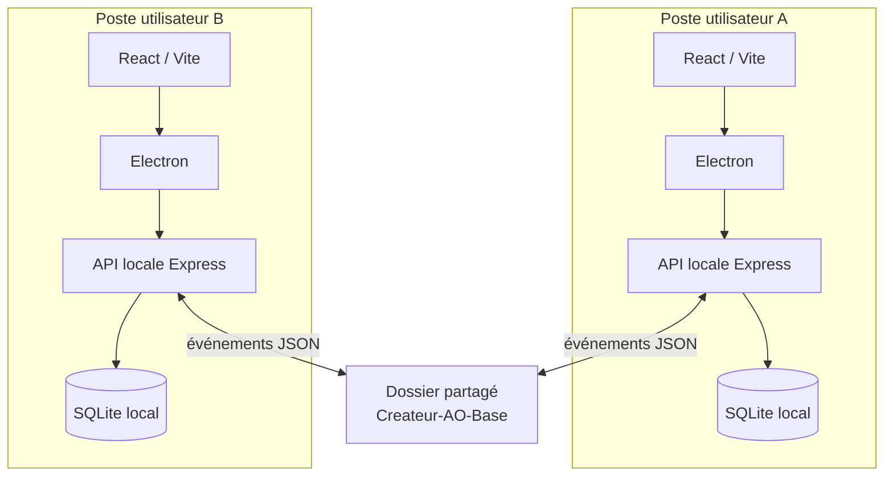
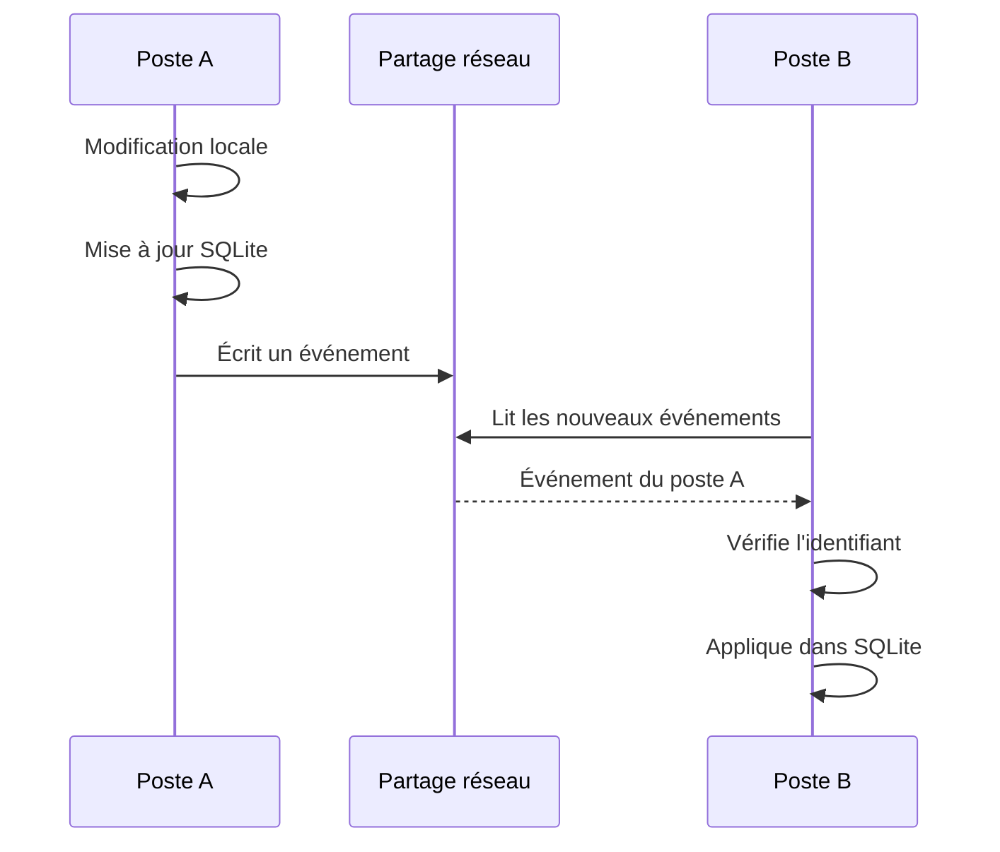
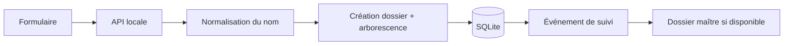

# Architecture de Créateur d’AO

Ce document décrit l’architecture technique de l’application, ses choix de conception et la manière dont plusieurs postes peuvent partager un même suivi sans serveur applicatif central.

## Objectifs de conception

L’architecture répond à quatre contraintes principales :

- conserver une interface rapide sur chaque poste ;
- fonctionner dans un environnement Windows classique avec partage réseau ;
- éviter l’ouverture simultanée d’une même base SQLite à travers SMB ;
- rester déployable sans infrastructure cloud ni service backend permanent.

Le principe retenu est donc **local-first avec synchronisation par événements**.

---

## Vue d’ensemble



Chaque poste possède sa propre base SQLite. Le partage réseau transporte des fichiers métier et, lorsqu’il est utilisé comme base maître, de petits événements de synchronisation.

---

## Composants

### Interface React

L’interface utilisateur est construite avec React et Vite. Elle fournit les vues de création, transfert, suivi et réglages.

Elle ne dialogue pas directement avec SQLite ou le système de fichiers. Les opérations sensibles passent par l’API locale.

### Electron

Electron fournit l’enveloppe desktop Windows et les intégrations natives nécessaires :

- fenêtre d’application ;
- sélecteurs de dossiers ;
- accès contrôlé aux fonctions exposées via le preload ;
- lancement de l’API locale avec l’application packagée ;
- icône et identité Windows.

### API locale

Le backend Node.js/Express écoute uniquement en local sur `127.0.0.1`.

Il centralise :

- création et déplacement de dossiers ;
- lecture et écriture des données de suivi ;
- synchronisation ;
- scans de statuts ;
- sauvegardes et restaurations ;
- gestion des réglages.

### SQLite local

Chaque poste matérialise son état dans une base locale située dans le profil utilisateur Windows.

Cette base contient notamment les AO suivis, réglages locaux, personnes associées aux postes et informations nécessaires à la synchronisation.

Le fichier SQLite n’est pas partagé directement entre plusieurs machines.

---

## Base maître partagée

Lorsque la synchronisation multi-postes est activée, l’utilisateur choisit un dossier partagé accessible aux postes concernés.

L’application y crée une structure logique similaire à :

```text
Createur-AO-Base/
└── peers/
    ├── PC_A/
    │   └── events/
    ├── PC_B/
    │   └── events/
    └── PC_C/
        └── events/
```

Chaque poste est le seul auteur de son propre journal. Les autres postes le lisent mais n’y écrivent pas.

Ce découpage évite qu’un même fichier soit constamment modifié par plusieurs ordinateurs.

---

## Journal d’événements

Une modification métier significative produit un événement contenant les informations nécessaires à sa réplication.

Chaque événement possède notamment :

- un identifiant unique ;
- un ordre local de séquence ;
- le poste émetteur ;
- une action ;
- les données nécessaires à l’application de cette action.

L’import est conçu pour être idempotent : relire un événement déjà appliqué ne doit pas dupliquer l’opération.



---

## Cycle de synchronisation

La synchronisation s’exécute périodiquement et peut également être déclenchée explicitement.

Un cycle type :

1. le poste vérifie l’accessibilité du dossier maître ;
2. il publie ses événements locaux non encore matérialisés sur le partage ;
3. il parcourt les journaux des autres postes ;
4. il ignore les événements déjà importés ;
5. il applique les nouveaux événements à sa base locale ;
6. l’interface reflète l’état convergé.

Cette approche privilégie la robustesse à la dépendance à une connexion permanente.

---

## Fonctionnement en cas de coupure réseau

Le poste peut continuer à utiliser sa base locale lorsque le partage maître n’est temporairement plus disponible pour les opérations qui ne nécessitent pas le serveur de fichiers.

Les événements locaux peuvent être publiés lors d’un cycle ultérieur lorsque le partage redevient accessible.

L’indisponibilité générale d’un partage doit être distinguée de la disparition réelle d’un dossier métier. Cette distinction est importante pour éviter de marquer massivement des AO comme `Introuvable` pendant une simple coupure réseau.

---

## Création d’un AO



Le nom logique suit la convention :

```text
AAAA_MM_JJ_CA_BE_CLIENT_INTITULE_COM_DEVIS
```

L’arborescence est générée récursivement à partir de la configuration active.

---

## Transfert

Le transfert n’est pas une simple modification de statut.

L’application :

1. sélectionne le dossier source ;
2. relit les informations disponibles ;
3. calcule le nom final ;
4. identifie la destination configurée ;
5. déplace le dossier ;
6. met à jour le suivi local ;
7. publie l’événement correspondant.

Un verrou temporaire peut être utilisé pour limiter le risque de transfert concurrent du même AO depuis deux postes.

---

## Statuts issus du système de fichiers

Le workflow peut s’appuyer sur des répertoires métier dont le préfixe représente un état :

```text
2 ...  → En cours
3 ...  → Envoyé / attente de décision
4 ...  → Gagné
5 ...  → Perdu
```

Le texte situé après le chiffre n’est pas imposé. Cela permet d’adapter les libellés à l’organisation sans modifier le moteur de détection.

Le scan est conçu pour regarder les emplacements utiles sans parcourir récursivement tout le contenu interne de chaque AO.

---

## Donnée de prix

Le prix est conservé dans le suivi et peut être matérialisé dans le dossier métier sous la forme :

```text
PRIX.txt
```

Cette redondance volontaire permet de conserver une information essentielle avec les fichiers du dossier, même en dehors de l’interface.

---

## Sauvegardes

Les sauvegardes concernent principalement les bases SQLite locales et, selon la configuration, les éléments de synchronisation utiles.

Une restauration doit toujours être précédée d’une sauvegarde de sécurité afin de permettre un retour arrière.

Les fichiers métier eux-mêmes restent sous la responsabilité de la politique de sauvegarde du serveur de fichiers ou du NAS utilisé par l’organisation.

---

## Sécurité des données

L’architecture ne nécessite pas d’exposer un serveur HTTP sur le réseau : l’API applicative écoute sur l’interface locale.

Le partage réseau doit être protégé par les mécanismes habituels de l’organisation :

- authentification Windows ;
- permissions NTFS et/ou SMB ;
- sauvegarde du serveur de fichiers ;
- contrôle antivirus/EDR ;
- journalisation adaptée au contexte.

Les chemins réels, identifiants et données métier ne doivent pas être ajoutés au dépôt Git.

---

## Déploiement

Deux modèles sont possibles :

### Installation locale

Chaque utilisateur installe l’application dans son profil Windows.

### Distribution centralisée depuis un partage

Une copie de référence est placée sur le serveur. Un lanceur synchronise les fichiers applicatifs vers `%LOCALAPPDATA%\CreateurAO\app` avant de démarrer l’exécutable local.

Le détail est fourni dans [DEPLOYMENT.md](DEPLOYMENT.md).

---

## Limites et choix assumés

Cette architecture n’a pas vocation à remplacer un serveur applicatif transactionnel pour des centaines d’utilisateurs simultanés.

Elle est pensée pour un environnement de petite ou moyenne équipe où :

- Windows et un partage réseau existent déjà ;
- le volume d’événements est raisonnable ;
- la simplicité de déploiement est prioritaire ;
- les fichiers métiers restent la source opérationnelle principale.

Si les besoins évoluent vers de très nombreux utilisateurs, des permissions métier complexes ou des exigences fortes de temps réel, le journal partagé pourra être remplacé par un service central et une base serveur sans remettre en cause l’interface métier.
