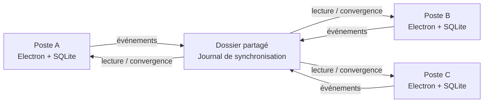

# Créateur d’AO

> Application Windows pour standardiser la création, le transfert et le suivi collaboratif des dossiers d’appels d’offres.


Créateur d’AO transforme un fonctionnement fondé sur des dossiers réseau, des conventions de nommage et des tableaux de suivi en un workflow unique, cohérent et partagé.

L’application reste volontairement légère : chaque poste travaille localement pour conserver une interface rapide, tandis qu’un dossier partagé peut servir de point de synchronisation entre plusieurs ordinateurs. Aucun serveur applicatif ou service cloud n’est nécessaire.

**[Téléchargements](../../releases)** · **[Guide utilisateur](USER_GUIDE.md)** · **[Déploiement](DEPLOYMENT.md)** · **[Architecture](ARCHITECTURE.md)**

---

## Pourquoi Créateur d’AO ?

Dans de nombreuses organisations, les appels d’offres sont gérés directement dans un serveur de fichiers. Ce fonctionnement est simple, mais il devient rapidement difficile à fiabiliser lorsqu’il faut garantir la même structure pour tous, suivre l’avancement d’un dossier, retrouver qui a effectué une action ou synchroniser plusieurs postes.

Créateur d’AO ajoute une couche applicative à ce fonctionnement sans imposer de changement d’infrastructure lourd.

Il permet notamment de :

- créer des dossiers selon une convention de nommage constante ;
- générer automatiquement une arborescence configurable ;
- transférer un dossier vers une destination métier en conservant son suivi ;
- visualiser l’état des appels d’offres dans une vue centralisée ;
- conserver contacts, remarques, prix, relances et historique ;
- partager le suivi entre plusieurs postes Windows ;
- fonctionner avec une base locale rapide tout en utilisant un simple partage réseau pour la synchronisation ;
- déployer l’application sans droits administrateur.

---

## Fonctionnalités

### Création normalisée

Un appel d’offres est créé à partir d’informations structurées puis matérialisé sur disque avec son arborescence.

La convention de nommage utilisée est :

```text
AAAA_MM_JJ_CA_BE_CLIENT_INTITULE_COM_DEVIS
```

Le BE ou le Client doit être renseigné. Les éléments facultatifs conservent leur emplacement afin de maintenir une structure prévisible.

### Arborescence configurable

La structure interne d’un nouvel AO n’est pas figée dans le code. Elle peut être adaptée depuis les réglages puis enregistrée dans un modèle de démarrage réutilisable sur un autre poste.

### Transfert de dossiers

L’onglet de transfert permet de sélectionner un dossier existant avec le sélecteur Windows, de relire ses informations, de le renommer si nécessaire puis de le déplacer vers une destination configurée.

### Suivi collaboratif

Chaque AO dispose d’un état exploitable dans la vue de suivi :

```text
À attribuer → En cours → Envoyé → Gagné / Perdu
```

Un statut `Introuvable` permet également de signaler un dossier qui n’est plus présent à l’emplacement attendu sans confondre ce cas avec une indisponibilité générale du partage réseau.

### Informations métier

Le suivi peut conserver notamment :

- contact ;
- prix ;
- remarques ;
- relances ;
- personne associée au poste ;
- emplacement du dossier ;
- historique des principales actions.

Le prix est également matérialisé dans le dossier par un fichier `PRIX.txt`, ce qui permet de conserver l’information au plus près des fichiers de l’AO.

### Synchronisation multi-postes

Chaque ordinateur possède sa propre base SQLite locale. Le partage réseau ne contient pas une base SQLite ouverte simultanément par plusieurs utilisateurs : il transporte seulement de petits événements JSON.

Cela permet de garder une interface réactive tout en évitant les principaux problèmes liés à l’utilisation directe d’une base de données sur SMB.



La synchronisation est détaillée dans [ARCHITECTURE.md](ARCHITECTURE.md).

### Sauvegardes

L’application prévoit des sauvegardes de la base locale et permet une restauration contrôlée avec création préalable d’une sauvegarde de sécurité.

### Recherche et filtres

Le suivi peut être filtré par personne, destination, statut ou recherche textuelle afin de retrouver rapidement un dossier.

---

## Philosophie technique

Créateur d’AO suit une approche **local-first** :

1. l’interface et l’API s’exécutent sur le poste utilisateur ;
2. SQLite conserve localement l’état courant ;
3. les fichiers métier restent dans les emplacements choisis par l’organisation ;
4. un dossier partagé peut servir de journal de synchronisation ;
5. aucune infrastructure cloud n’est nécessaire au fonctionnement normal.

Cette architecture convient particulièrement aux environnements Windows disposant déjà d’un serveur de fichiers ou d’un NAS et souhaitant ajouter du suivi sans déployer un serveur applicatif complet.

---

## Installation

### Installation Windows classique

Télécharger `Createur-AO-Setup.exe` depuis la page **Releases** puis lancer l’installateur.

L’installation est prévue pour le profil utilisateur et ne nécessite pas d’élévation administrateur dans sa configuration standard.

### Déploiement depuis un partage réseau

Pour un usage sur plusieurs postes, l’application peut être déposée sur un partage central puis copiée automatiquement dans `%LOCALAPPDATA%` au lancement. Les utilisateurs exécutent ainsi une copie locale rapide tout en récupérant les fichiers plus récents présents sur le serveur.

La procédure complète est décrite dans [DEPLOYMENT.md](DEPLOYMENT.md).

---

## Premier lancement

Le premier poste peut configurer :

- les destinations de création ;
- les destinations de transfert ;
- l’arborescence de nouveaux AO ;
- le dossier maître partagé ;
- les correspondances entre noms de PC et personnes ;
- les emplacements utilisés pour le scan des statuts.

Cette configuration peut être exportée dans un modèle de démarrage JSON, puis importée sur un autre poste sans inclure de chemin privé dans le dépôt Git.

Le parcours complet est documenté dans [USER_GUIDE.md](USER_GUIDE.md).

---

## Données et confidentialité

Créateur d’AO est conçu pour fonctionner localement et sur les emplacements explicitement choisis par l’organisation.

- aucune donnée métier n’est nécessaire dans le dépôt Git ;
- aucun chemin réseau d’entreprise n’est codé en dur dans la documentation publique ;
- la base SQLite utilisateur reste dans le profil local Windows ;
- le partage réseau ne sert qu’aux fichiers métier et, si activé, aux journaux de synchronisation ;
- aucune télémétrie applicative n’est requise pour utiliser le produit.

Pour les considérations de sécurité et de déploiement en entreprise, voir [SECURITY.md](SECURITY.md).

---

## Stack technique

| Couche | Technologie |
| --- | --- |
| Interface | React + Vite |
| Application desktop | Electron |
| API locale | Node.js + Express |
| Persistance | SQLite via `better-sqlite3` |
| Synchronisation | Journal d’événements sur dossier partagé |
| Packaging Windows | electron-builder + NSIS |
| Tests | Node.js Test Runner |

---

## Développement

Prérequis : Node.js récent compatible avec le projet.

```bash
npm install
npm run dev
```

### Vérification complète

```bash
npm run check
```

Cette commande exécute les tests, construit l’interface et vérifie la syntaxe des principaux fichiers Node/Electron.

### Tests seuls

```bash
npm test
```

Les tests couvrent notamment la création des dossiers, le workflow métier, le runtime et la convergence de deux postes via une base maître simulée.

### Construction Windows

```bash
npm run dist:win
```

Les artefacts sont générés dans `release/`.

---

## Documentation

| Document | Contenu |
| --- | --- |
| [USER_GUIDE.md](USER_GUIDE.md) | Utilisation quotidienne et premier démarrage |
| [DEPLOYMENT.md](DEPLOYMENT.md) | Installation, partage réseau et déploiement multi-postes |
| [ARCHITECTURE.md](ARCHITECTURE.md) | Architecture détaillée et synchronisation |
| [SECURITY.md](SECURITY.md) | Modèle de sécurité et données |
| [CONTRIBUTING.md](CONTRIBUTING.md) | Développement et contributions |

---

## Contributions

Les rapports de bugs, suggestions et propositions d’amélioration peuvent être soumis via les Issues GitHub. Le code source reste néanmoins distribué sous une **licence propriétaire** : la présence du dépôt public ne constitue pas une autorisation de réutilisation, modification, redistribution ou commercialisation.

Consulter [CONTRIBUTING.md](CONTRIBUTING.md) avant toute contribution.

---

## Licence

Créateur d’AO est un logiciel propriétaire. Tous droits réservés.

Le code peut être consulté à des fins d’évaluation et de contribution, mais aucune autorisation d’utilisation, copie, modification, distribution, sous-licence ou commercialisation n’est accordée sauf permission écrite explicite du titulaire des droits.

Voir [LICENSE](LICENSE) pour les conditions complètes.
